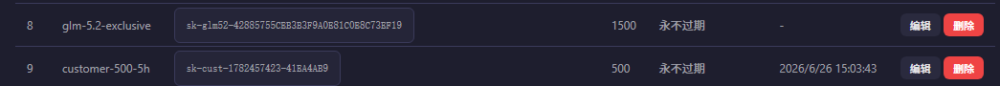
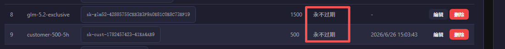
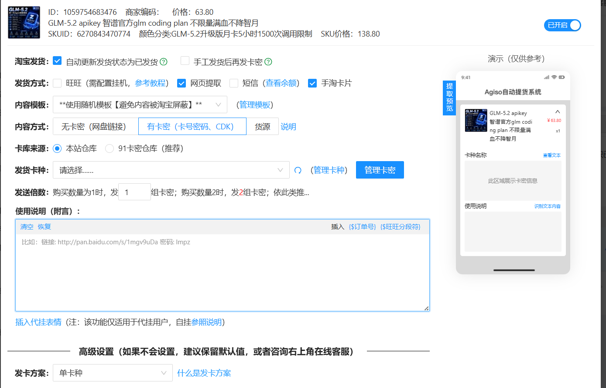
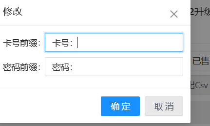
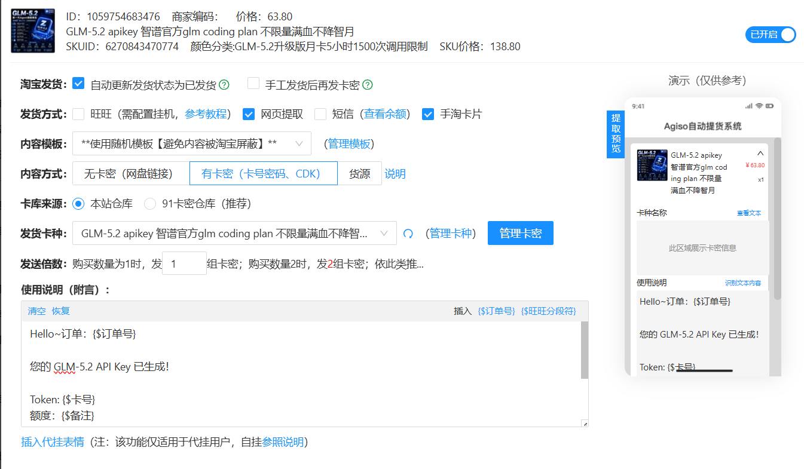

# 淘宝自动发货配置指南 - GLM-5.2 API Key

**创建时间**: 2026-06-27  
**负责人**: 艾隆 (Elon)  
**状态**: ✅ 已上线并验证通过

---

## 📋 目录

1. [前置准备](#前置准备)
2. [Token 生成与管理](#token-生成与管理)
3. [千牛插件配置](#千牛插件配置)
4. [常见问题](#常见问题)

---

## 前置准备

### 1. atmApi 服务状态确认

确保 atmApi 服务正常运行：

```bash
systemctl status atmapi
ss -tlnp | grep 3002
curl -s http://localhost:3002/health
```

### 2. 帮助文档页面

访问地址：https://atmapi.aitomoney.online/help

该页面包含：
- Token 使用说明
- 代码示例（Python、JavaScript、cURL、OpenClaw）
- 常见问题解答

### 3. 快速生成页面（可选）

访问地址：https://atmapi.aitomoney.online/generate-token

用于手动实时生成 Token，适合临时补货。

---

## Token 生成与管理

### 方案 A：预先生成批量 Token（推荐新手）

#### 1. 生成 Token

在 atmApi 数据库中预先生成三种品类的 Token：

```bash
# 入门版（500次/5小时）
sqlite3 ~/.openclaw/workspace/atmApi/data/atmapi.db \
  "INSERT INTO tokens (name, key, status, remain_quota, init_quota, unlimited_quota, expired_time, created_time, accessed_time) 
   VALUES ('tb-starter-01', 'sk-tb-starter-xxx', 1, 500, 500, 0, $(date -d '+35 days' +%s), $(date +%s), $(date +%s));"

# 专业版（1000次/5小时）
# 旗舰版（1500次/5小时）
```

#### 2. 导出 CSV 文件

```bash
# 入门版
sqlite3 ~/.openclaw/workspace/atmApi/data/atmapi.db \
  "SELECT key, name FROM tokens WHERE key LIKE 'sk-tb-%' AND name LIKE '%starter%';" \
  | while IFS='|' read -r token name; do echo "${token},,${name}"; done > /tmp/glm_starter.csv

# 专业版
sqlite3 ~/.openclaw/workspace/atmApi/data/atmapi.db \
  "SELECT key, name FROM tokens WHERE key LIKE 'sk-tb-%' AND name LIKE '%pro%';" \
  | while IFS='|' read -r token name; do echo "${token},,${name}"; done > /tmp/glm_pro.csv

# 旗舰版
sqlite3 ~/.openclaw/workspace/atmApi/data/atmapi.db \
  "SELECT key, name FROM tokens WHERE key LIKE 'sk-tb-%' AND name LIKE '%max%';" \
  | while IFS='|' read -r token name; do echo "${token},,${name}"; done > /tmp/glm_max.csv
```

**CSV 格式说明：**
```
卡号,,备注
sk-tb-…xxxx,,tb-starter-01
```
- 第1列：Token（卡号）
- 第2列：密码（留空）
- 第3列：备注（品类名称）

#### 3. 设置有效期

```bash
# 设置 35 天有效期
sqlite3 ~/.openclaw/workspace/atmApi/data/atmapi.db \
  "UPDATE tokens SET expired_time = $(date -d '+35 days' +%s) WHERE key LIKE 'sk-tb-%';"
```

---

### 方案 B：实时生成 Token（高级用户）

使用公开 API 接口：

```bash
curl -X POST http://localhost:3002/api/generate-token \
  -H "Content-Type: application/json" \
  -d '{"tier": "starter"}'
```

**返回示例：**
```json
{
  "token": "sk-tb-…xxxx",
  "name": "tb-starter-auto-1782517211",
  "tier": "starter",
  "quota": 500,
  "expires_at": "2026-08-01 07:40:11"
}
```

**支持的品类：**
- `starter` - 入门版（500次/5小时）
- `pro` - 专业版（1000次/5小时）
- `max` - 旗舰版（1500次/5小时）

---

## 千牛插件配置

### 步骤 1：进入自动发货插件



1. 登录千牛后台
2. 找到"自动发货"插件
3. 点击配置按钮

### 步骤 2：选择发卡模式



**关键设置：**
- ****关键设置：**
- ✅ **发卡方式**：单卡（每个订单发一个 Token）
- ❌ **固定发一**：不勾选（按实际购买数量发）
- **发货限制**：小于 1 不发，大于 5 不发（防止恶意批量购买）

### 步骤 3：配置卡密来源



**关键设置：**
- **淘宝发货**：✅ 自动更新发货状态为已发货
- **发货方式**：网页提取 + 手淘卡片
- **内容方式**：有卡密（卡号密码、CDK）
- **卡库来源**：本站仓库

### 步骤 4：导入 Token



**操作流程：**
1. 点击"添加"按钮
2. 选择"批量导入"
3. 分隔符选择"逗号"
4. 粘贴 CSV 内容（格式：`sk-tb-…xxxx,,tb-starter-01`）
5. 点击"添加"完成导入

**CSV 格式示例：**
```
sk-tb-…704B,,tb-starter-01
sk-tb-…D85D,,tb-starter-02
sk-tb-…305E,,tb-starter-03
```

### 步骤 5：创建三个独立卡种

为了根据商品品类自动匹配 Token，需要创建 3 个独立卡种：

| 卡种名称 | 对应 SKU | Token 数量 | 额度 |
|---------|---------|-----------|------|
| GLM-5.2 入门版 | starter | 5-6 个 | 500次/5小时 |
| GLM-5.2 专业版 | pro | 5 个 | 1000次/5小时 |
| GLM-5.2 旗舰版 | max | 5 个 | 1500次/5小时 |

**操作方法：**
1. 重复步骤 4，分别导入 3 个 CSV 文件
2. 每个卡种单独命名

### 步骤 6：配置自动回复模板



在"使用说明（附言）"中填入：

```
Hello~订单：{$订单号}

您的 GLM-5.2 API Key 已生成！

Token: {$卡号}
额度：{$备注}

📖 使用说明：https://atmapi.aitomoney.online/help

谢谢！再来哦~
```

**变量说明：**
- `{$订单号}` → 自动替换为淘宝订单号
- `{$卡号}` → 自动替换为 Token
- `{$备注}` → 自动替换为品类名称（如 tb-starter-01）

### 步骤 7：关联商品 SKU

在淘宝商品编辑页面：
1. 找到对应的 SKU（入门版/专业版/旗舰版）
2. 在"自动发货"选项中，选择对应的卡种
3. 保存商品

---

## 常见问题

### Q1: Token 用完了怎么办？

**方案 A**：等待 5 小时，额度自动重置  
**方案 B**：重新生成一批新 Token，导入千牛  
**方案 C**：使用快速生成页面手动补货：https://atmapi.aitomoney.online/generate-token

### Q2: 如何查看剩余额度？

访问监控面板：https://atmapi.aitomoney.online/monitor  
输入 Token 即可查询实时用量。

### Q3: Token 会过期吗？

当前配置的 Token 有效期为 **35 天**（从生成之日起）。  
过期后需要重新生成新 Token。

### Q4: 买家收不到消息怎么办？

检查以下设置：
1. 千牛插件是否开启"旺旺发送"
2. "发货声明"是否开启（建议关闭，避免重复发送）
3. 附言模板中的变量是否正确

### Q5: 如何测试自动发货？

1. 用自己的小号下一个测试订单
2. 付款后观察是否自动发货
3. 检查收到的 Token 是否能正常调用 API

---

## 附录：截图清单

| 截图编号 | 说明 | 文件名 |
|---------|------|--------|
| 1 | 自动发货插件配置入口 | step1-config.png |
| 2 | 发卡模式选择（单卡） | step2-mode.png |
| 3 | 卡密来源配置 | step3-card-source.png |
| 4 | 批量导入 Token | step4-import.png |
| 5 | 自动回复模板配置 | step6-message.png |

**截图存放位置**: `~/.openclaw/workspace/atmApi/docs/screenshots/`

---

**最后更新**: 2026-06-27  
**维护者**: 艾隆 (Elon)
